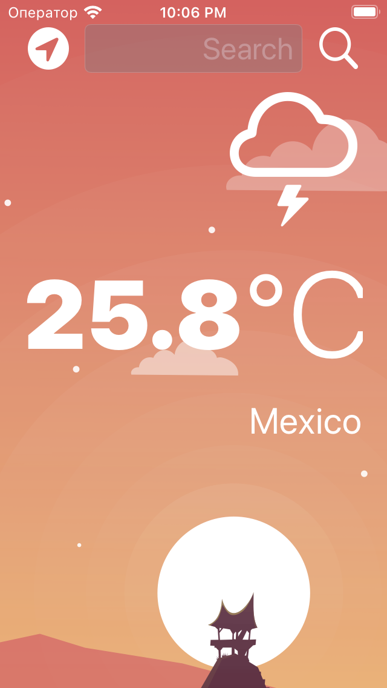
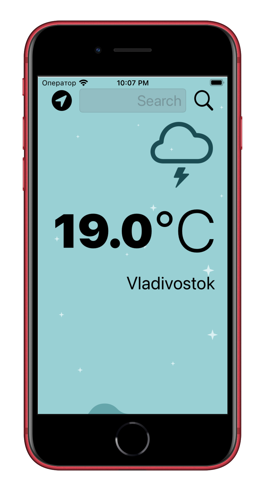

#  Clima

A beautiful weather app with support for dark mode has been created. The ability to check the weather for the current location based on GPS data from the iPhone, as well as by manually searching the city.

## What has been studied

* How to create a dark-mode enabled app.
* How to use vector images as image assets.
* Learn to use the UITextField to get user input. 
* Learn about the delegate pattern.
* Swift protocols and extensions. 
* Swift guard keyword. 
* Swift computed properties.
* Swift closures and completion handlers.
* Learned to use URLSession to network and make HTTP requests.
* Parse JSON with the native Encodable and Decodable protocols. 
* Learned to use Grand Central Dispatch to fetch the main thread.
* Learned to use Core Location to get the current location from the phone GPS. 

<table>
  <tr>
    <td></td>
    <td></td>
    </tr>
 </table>