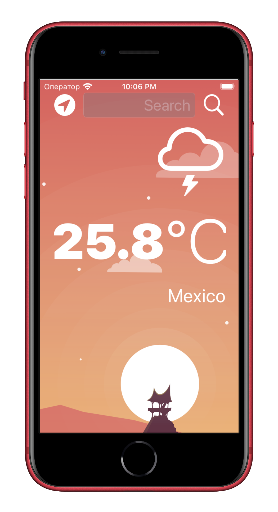

#  Clima

### Description:
A beautiful weather app with support for dark mode has been created. The ability to check the weather for the current location based on GPS data from the iPhone, as well as by manually searching the city. 

The UI of the application is completely written in code without the use of storyboards.

The project uses an open API https://openweathermap.org

```
//The key is here:
    let weatherURL = URL(string: "https://api.openweathermap.org/data/2.5/weather?appid=********************************&units=metric")!
```


### Technologies used:
- Foundation
- UIKit
- Core Location
- URLSession
- Delegate Pattern
- Error handling
```
enum ServiceError: Error {
    case network(statusCode: Int)
    case parsing
    case general(reason: String)
}
```
- XCTest
```
...

func testCanParseWeatherNoCityName() throws {
        let json = """
         {
           "weather": [
             {
               "id": 804,
               "description": "overcast clouds",
             }
           ],
           "main": {
             "temp": 10.58,
           },
           "name": ""
         }
        """

        let jsonData = json.data(using: .utf8)!
        let weatherData = try! JSONDecoder().decode(WeatherData.self, from: jsonData)

        XCTAssertEqual(10.58, weatherData.main.temp)
        XCTAssertEqual("", weatherData.name)
    }

...
```

### Screenshots:

  <tr>
    <td></td>
    <td></td>
  </tr>
